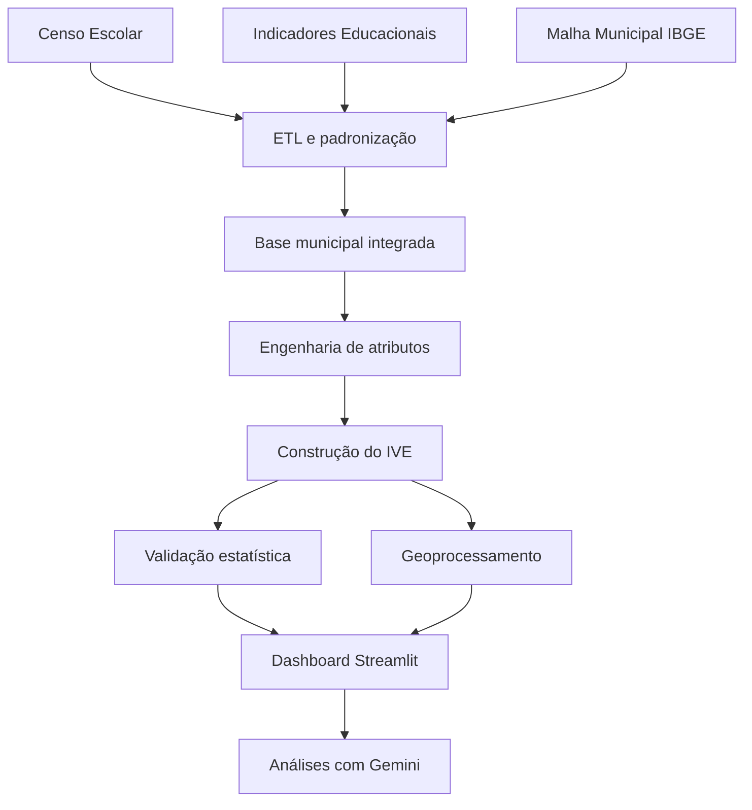

# Mapa da Vulnerabilidade Educacional

Projeto de Ciência de Dados aplicado às políticas públicas educacionais, desenvolvido para identificar e comparar padrões de vulnerabilidade entre os municípios do Rio Grande do Sul.

[](https://www.python.org/)
[](https://mapa-vulnerabilidade-educacional-thmfxanehq3c5wzxshom4i.streamlit.app/)
[](https://mapa-vulnerabilidade-educacional-thmfxanehq3c5wzxshom4i.streamlit.app/)

## Visão geral

O projeto organiza dados públicos educacionais e territoriais em uma base analítica municipal e constrói o **Índice de Vulnerabilidade Educacional (IVE)**, sintetizando diferentes dimensões associadas ao fluxo escolar, à infraestrutura e ao contexto socioeconômico.

A solução combina engenharia de dados, análise estatística, geoprocessamento, visualização interativa e IA generativa. O resultado é um dashboard público que permite explorar o perfil de 496 municípios do Rio Grande do Sul, identificar territórios prioritários e gerar análises municipais em linguagem natural.

## Aplicação online

Acesse o dashboard:

**[Mapa da Vulnerabilidade Educacional — Streamlit](https://mapa-vulnerabilidade-educacional-thmfxanehq3c5wzxshom4i.streamlit.app/)**

## Problema de pesquisa

> Quais municípios apresentam maior vulnerabilidade educacional, considerando desempenho do fluxo escolar, distorção idade-série, infraestrutura, nível socioeconômico e contexto territorial?

O projeto busca transformar bases públicas dispersas em um produto analítico acessível, capaz de apoiar a priorização de territórios por gestores públicos, pesquisadores e organizações sociais.

## Principais funcionalidades

- construção de uma base municipal integrada para o Rio Grande do Sul;
- cálculo do Índice de Vulnerabilidade Educacional para 496 municípios;
- classificação absoluta e relativa dos municípios por faixa de vulnerabilidade;
- ranking municipal;
- mapas temáticos estáticos e interativos;
- filtros por faixa e categoria do IVE;
- perfil analítico de cada município;
- gráficos de distribuição, correlação e dispersão;
- comparação entre indicadores municipais e médias estaduais;
- análises automáticas geradas com a API do Gemini;
- testes automatizados para validação do pipeline, do índice e dos componentes do dashboard;
- deploy no Streamlit Community Cloud.

## Escopo atual

- **Unidade de análise:** município;
- **Recorte territorial:** Rio Grande do Sul;
- **Ano-base principal:** 2024;
- **Municípios no recorte territorial:** 497;
- **Municípios com IVE calculado:** 496;
- **Fontes centrais:** Inep e IBGE;
- **Produto final:** dashboard interativo com mapa, ranking, diagnóstico municipal e IA generativa.

### Cobertura municipal

O Rio Grande do Sul possui 497 municípios. Entretanto, o IVE foi calculado para 496 deles. Um município não possuía escola com oferta de Ensino Médio no ano analisado e, por esse motivo, não apresentava as informações necessárias para compor os indicadores utilizados no índice.

A exclusão, portanto, não decorre de falha no processamento ou perda acidental de registros, mas de uma decisão metodológica coerente com o recorte do projeto. O dashboard e as análises comparativas consideram apenas os municípios para os quais foi possível construir o conjunto completo de informações exigido pelo IVE.

## Fontes de dados

| Fonte | Conjunto de dados | Uso no projeto |
|---|---|---|
| Inep | Censo Escolar 2024 | matrículas, escolas, localização, dependência administrativa e infraestrutura |
| Inep | Indicadores de rendimento | aprovação, reprovação e abandono |
| Inep | Distorção idade-série | defasagem escolar |
| Inep | Indicador de Nível Socioeconômico | contexto socioeconômico municipal |
| IBGE | Malha Municipal | geometrias e visualização espacial |
| IBGE | Códigos dos municípios | padronização das chaves territoriais |

## Arquitetura da solução



## Pipeline de dados

```text
Coleta e inspeção
        ↓
Padronização das bases
        ↓
Seleção das variáveis
        ↓
Agregação no nível municipal
        ↓
Integração dos indicadores
        ↓
Tratamento de valores ausentes
        ↓
Engenharia de atributos
        ↓
Construção do IVE
        ↓
Validação estatística
        ↓
Integração geoespacial
        ↓
Dashboard e IA generativa
```

## Índice de Vulnerabilidade Educacional

O IVE foi construído como um índice composto, com variáveis normalizadas em uma escala comum e orientadas para que valores mais altos representem maior vulnerabilidade.

As dimensões centrais consideradas são:

- abandono;
- reprovação;
- distorção idade-série;
- infraestrutura escolar;
- nível socioeconômico.

A versão manual do índice foi mantida como medida principal após comparação com alternativas produzidas por Análise de Componentes Principais e Análise Fatorial. A validação incluiu correlações, estabilidade de rankings, concordância entre os municípios mais vulneráveis e análise de sensibilidade.

Na base final, o IVE foi calculado para 496 municípios e apresentou média de aproximadamente **0,281**, com valores variando entre **0,057** e **0,648**.

## Validação estatística

A robustez do índice foi investigada por três estratégias:

1. **IVE manual**, baseado em pesos definidos a partir da lógica substantiva dos indicadores;
2. **Análise de Componentes Principais (PCA)**;
3. **Análise Fatorial**.

Entre os principais resultados:

- a primeira componente da PCA explicou aproximadamente 33% da variância;
- abandono, reprovação e distorção apresentaram as maiores cargas positivas;
- o INSE apresentou associação inversa com a vulnerabilidade;
- o IVE manual apresentou elevada concordância com a PCA entre os municípios de maior vulnerabilidade;
- a análise fatorial foi mantida como ferramenta complementar de validação, mas não substituiu o índice principal.

## Dashboard

O dashboard foi desenvolvido com Streamlit e organizado em componentes reutilizáveis. A interface permite:

- navegar pelo mapa interativo;
- aplicar filtros sobre o IVE;
- selecionar municípios;
- consultar indicadores e ranking;
- comparar o município com a média estadual;
- explorar gráficos de distribuição, dispersão e correlação;
- gerar interpretações automáticas com IA.

## IA generativa

A aplicação utiliza a API do Gemini para transformar indicadores e resultados gráficos em textos interpretativos em português.

As análises são geradas para:

- perfil municipal;
- distribuição das categorias do IVE;
- relação entre infraestrutura e vulnerabilidade;
- matriz de correlação dos indicadores.

A integração inclui validação do prompt, tratamento de erros, cache e configuração segura da chave da API por variável de ambiente ou Secrets do Streamlit.

## Tecnologias utilizadas

### Linguagem e análise

- Python
- Pandas
- NumPy
- SciPy
- Scikit-learn
- Statsmodels

### Visualização e geoprocessamento

- Plotly
- Matplotlib
- GeoPandas
- Folium
- Streamlit Folium
- Shapely
- PyProj

### Aplicação e IA

- Streamlit
- Google Gemini API
- Python Dotenv

### Qualidade e versionamento

- Pytest
- Ruff
- Git
- GitHub
- Streamlit Community Cloud

## Estrutura do repositório

```text
mapa-vulnerabilidade-educacional/
├── dashboard/              # Aplicação Streamlit e componentes
├── data/
│   ├── raw/                # Dados originais
│   ├── interim/            # Dados intermediários
│   ├── processed/          # Bases analíticas e geoespaciais
│   └── external/           # Arquivos externos, incluindo malhas
├── docs/                   # Documentação técnica e metodológica
├── notebooks/              # Exploração e validações complementares
├── reports/
│   ├── figures/            # Gráficos
│   ├── maps/               # Mapas
│   └── tables/             # Tabelas e relatórios
├── src/                    # Pipeline de dados e módulos analíticos
├── tests/                  # Testes automatizados
├── main.py                 # Execução principal do pipeline geoespacial
├── requirements.txt        # Dependências do dashboard
└── README.md
```

## Como executar localmente

### 1. Clonar o repositório

```bash
git clone https://github.com/thiagofalheiros-costa/mapa-vulnerabilidade-educacional.git
cd mapa-vulnerabilidade-educacional
```

### 2. Criar e ativar um ambiente virtual

```bash
python -m venv .venv
```

No Windows:

```powershell
.\.venv\Scripts\Activate.ps1
```

No Linux ou macOS:

```bash
source .venv/bin/activate
```

### 3. Instalar as dependências

```bash
python -m pip install -r requirements.txt
```

### 4. Configurar a chave do Gemini

Crie um arquivo `.env` na raiz do projeto:

```env
GEMINI_API_KEY=SUA_CHAVE_AQUI
```

O arquivo `.env` é ignorado pelo Git e não deve ser versionado.

### 5. Executar o dashboard

```bash
python -m streamlit run dashboard/app.py
```

## Testes

Para executar a suíte de testes:

```bash
python -m pytest
```

Os testes cobrem, entre outros pontos:

- agregação municipal;
- engenharia de atributos;
- construção do IVE;
- estabilidade dos rankings;
- PCA e análise fatorial;
- funções geoespaciais;
- geração dos prompts;
- integração com o Gemini;
- preparação dos dados dos gráficos.

## Roadmap do projeto

| Sprint | Entrega principal | Status |
|---|---|---|
| 1 | estrutura inicial e definição do MVP | concluída |
| 2 | inspeção e pré-processamento do Censo Escolar | concluída |
| 3 | agregação municipal e testes | concluída |
| 4 | engenharia de atributos municipais | concluída |
| 5 | integração dos indicadores educacionais | concluída |
| 6 | construção do IVE | concluída |
| 7 | validação estatística por PCA e análise fatorial | concluída |
| 8 | visualização geoespacial | concluída |
| 9 | dashboard Streamlit | concluída |
| 10 | integração com IA generativa | concluída |
| 11 | otimização do mapa e organização dos componentes | concluída |
| 12 | refatoração, cache e testes de regressão | concluída |
| 13 | deploy no Streamlit Community Cloud | concluída |
| 14 | documentação open source e preparação da versão 1.0 | concluída |

## Limitações

- o índice resume dimensões complexas em uma única medida sintética;
- os resultados dependem da cobertura e da qualidade das bases públicas;
- o recorte atual está concentrado no Rio Grande do Sul e no ano-base de 2024;
- um dos 497 municípios do estado não integra o IVE por não possuir escola com oferta de Ensino Médio no ano analisado;
- a associação entre indicadores não deve ser interpretada automaticamente como causalidade;
- os textos produzidos pela IA são recursos de apoio e devem ser analisados criticamente.

## Autor

**Thiago Falheiros**
