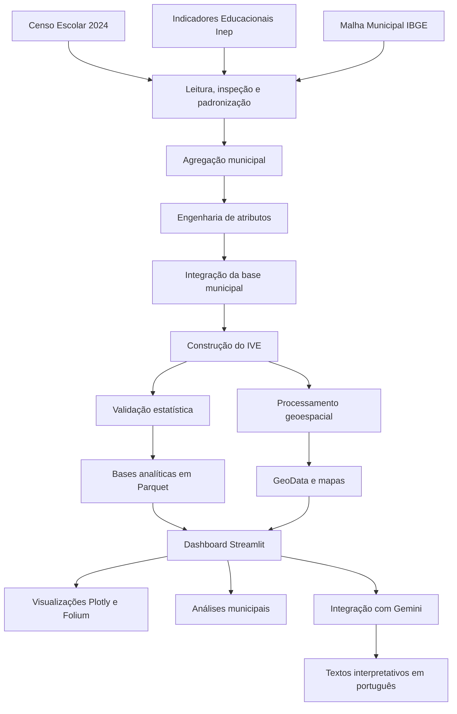

# Arquitetura do Projeto

## 1. Visão geral

O **Mapa da Vulnerabilidade Educacional** foi estruturado como uma aplicação de Ciência de Dados de ponta a ponta. A arquitetura separa o processamento analítico, a construção do índice, o geoprocessamento, a interface do dashboard, a integração com IA generativa e os testes automatizados.

O projeto trabalha com dados públicos educacionais e territoriais, consolidados no nível municipal, e produz uma aplicação interativa para os 497 municípios do Rio Grande do Sul.

A organização adotada busca atender a quatro objetivos principais:

1. manter o pipeline analítico separado da camada de apresentação;
2. favorecer a reutilização dos módulos;
3. permitir testes independentes por componente;
4. garantir que a aplicação possa ser executada localmente e em ambiente de produção.

## 2. Diagrama de arquitetura



## 3. Camadas da solução

### 3.1. Camada de dados

A camada de dados está organizada em quatro estágios:

```text
data/
├── raw/          # arquivos originais
├── interim/      # dados intermediários
├── processed/    # bases analíticas prontas para uso
└── external/     # arquivos auxiliares e fontes externas
```

Os arquivos brutos são preservados sem alterações. As transformações geram bases intermediárias e, posteriormente, arquivos processados em formato Parquet.

Entre os principais produtos dessa camada estão:

- `censo_escolar_rs_2024.parquet`;
- `municipios_features.parquet`;
- `municipality_indicators.parquet`;
- `municipality_base.parquet`;
- `municipality_vulnerability.parquet`;
- `municipality_geodata.parquet`.

As duas últimas bases alimentam diretamente a aplicação publicada.

### 3.2. Camada de configuração

O arquivo `src/config.py` centraliza:

- raiz do projeto;
- diretórios de dados e relatórios;
- caminhos das bases;
- caminhos da malha municipal;
- arquivos de saída;
- ano-base;
- unidade federativa;
- parâmetros gerais do projeto.

Essa centralização reduz a duplicação de caminhos em diferentes scripts e facilita a reprodução do projeto em outros ambientes.

### 3.3. Camada de ingestão e inspeção

Os módulos de ingestão e inspeção têm como responsabilidade:

- localizar arquivos nas pastas de dados;
- ler CSV, Excel e Parquet;
- inspecionar colunas e tipos;
- padronizar nomes de variáveis;
- produzir relatórios de estrutura e qualidade;
- identificar valores ausentes e inconsistências.

Principais módulos:

```text
src/load_data.py
src/inspect_data.py
src/inspect_high_school_columns.py
src/inspect_indicators.py
src/preprocess_censo.py
src/validate_censo.py
```

### 3.4. Camada de agregação e engenharia de atributos

Essa camada converte a base escolar em uma base municipal.

Principais responsabilidades:

- agregar escolas por município;
- contabilizar escolas e matrículas;
- calcular proporções de infraestrutura;
- calcular composição administrativa e localização;
- produzir indicadores sintéticos municipais.

Principais módulos:

```text
src/aggregation/aggregate_censo.py
src/features/censo_features.py
src/municipality_features.py
src/build_municipality_base.py
```

### 3.5. Camada de integração dos indicadores

Os indicadores do Inep são lidos e integrados por código municipal.

As principais dimensões incorporadas são:

- aprovação;
- reprovação;
- abandono;
- distorção idade-série;
- nível socioeconômico.

Principais módulos:

```text
src/load_indicators.py
src/merge_indicators.py
src/validate_municipality_base.py
```

O principal produto dessa camada é `municipality_base.parquet`.

### 3.6. Camada de construção do IVE

O Índice de Vulnerabilidade Educacional é construído a partir de variáveis normalizadas e orientadas para que valores maiores representem maior vulnerabilidade.

O módulo central é:

```text
src/vulnerability_index.py
```

Essa camada produz:

- valor contínuo do IVE;
- categoria absoluta;
- categoria relativa;
- faixa de vulnerabilidade;
- ranking estadual.

O resultado final é salvo em:

```text
data/processed/municipality_vulnerability.parquet
```

### 3.7. Camada de validação estatística

A estrutura de validação compara o índice manual com alternativas orientadas pelos dados.

Métodos utilizados:

- Análise de Componentes Principais;
- Análise Fatorial;
- correlações entre índices;
- estabilidade de rankings;
- concordância entre os municípios prioritários;
- indicadores de adequação fatorial.

Principais módulos:

```text
src/validate_pca.py
src/validate_factor.py
src/compare_indices.py
src/validation_report.py
src/vulnerability_analysis.py
```

A validação sustenta a manutenção do IVE manual como índice principal e trata PCA e Análise Fatorial como estratégias complementares.

### 3.8. Camada geoespacial

A camada geoespacial integra a base municipal à malha do IBGE.

Principais responsabilidades:

- leitura da malha municipal;
- padronização do código de município;
- junção entre geometrias e indicadores;
- criação de mapas contínuos e categóricos;
- geração de mapa interativo;
- produção da base geográfica utilizada pelo dashboard.

Principais módulos:

```text
src/geospatial.py
src/run_geospatial.py
```

Principais saídas:

```text
data/processed/municipality_geodata.parquet
reports/maps/ive_municipios_rs_continuo.png
reports/maps/ive_municipios_rs_categorias.png
reports/maps/ive_municipios_rs_prioritarios.png
reports/maps/ive_municipios_rs_interativo.html
```

### 3.9. Camada de apresentação

A interface foi construída com Streamlit e organizada em componentes reutilizáveis.

```text
dashboard/
├── app.py
└── components/
    ├── chart_data.py
    ├── chart_insights.py
    ├── charts.py
    ├── data_loader.py
    ├── filters.py
    ├── gemini_service.py
    ├── map.py
    ├── municipality_insights.py
    └── municipality_profile.py
```

O arquivo `dashboard/app.py` coordena a interface e chama os demais componentes.

#### Responsabilidades dos componentes

| Componente | Responsabilidade |
|---|---|
| `data_loader.py` | localizar e carregar as bases municipais |
| `filters.py` | construir e aplicar filtros do dashboard |
| `map.py` | carregar o GeoData e renderizar o mapa Folium |
| `chart_data.py` | preparar agregações e estruturas para os gráficos |
| `charts.py` | criar e exibir visualizações Plotly |
| `municipality_profile.py` | exibir o diagnóstico detalhado do município |
| `municipality_insights.py` | construir o prompt da análise municipal |
| `chart_insights.py` | construir prompts para as análises dos gráficos |
| `gemini_service.py` | gerenciar cliente, chamadas, erros e cache da API |

### 3.10. Camada de IA generativa

A integração com Gemini está isolada em um serviço próprio, evitando que a lógica de API seja espalhada pela aplicação.

Fluxo simplificado:

```text
Dados filtrados
      ↓
Construção do prompt
      ↓
Validação do conteúdo
      ↓
Chamada ao Gemini
      ↓
Tratamento da resposta
      ↓
Cache
      ↓
Texto apresentado no dashboard
```

A chave da API é obtida por variável de ambiente no desenvolvimento local e por Secrets no Streamlit Community Cloud.

A IA não altera o índice nem os dados. Ela atua apenas na camada interpretativa, transformando indicadores e relações estatísticas em textos de apoio.

### 3.11. Camada de testes

A pasta `tests/` contém testes para diferentes partes da solução.

Os testes cobrem:

- agregação do Censo Escolar;
- engenharia de atributos;
- construção e categorização do IVE;
- estabilidade dos rankings;
- validações por PCA e Análise Fatorial;
- funções geoespaciais;
- preparação dos dados dos gráficos;
- construção dos prompts;
- integração e tratamento de erros do Gemini.

O framework utilizado é o Pytest.

## 4. Fluxo de execução

O projeto possui dois fluxos principais.

### 4.1. Fluxo analítico

```text
Arquivos brutos
      ↓
Pré-processamento
      ↓
Agregação municipal
      ↓
Integração de indicadores
      ↓
Construção do IVE
      ↓
Validação estatística
      ↓
Processamento geoespacial
      ↓
Bases finais
```

Esse fluxo é executado localmente durante a atualização dos dados ou reconstrução dos produtos analíticos.

### 4.2. Fluxo da aplicação

```text
Streamlit inicia
      ↓
Carregamento das bases processadas
      ↓
Aplicação dos filtros
      ↓
Renderização de métricas, gráficos e mapa
      ↓
Seleção de município
      ↓
Exibição do perfil municipal
      ↓
Geração opcional de análise com Gemini
```

A aplicação publicada não executa todo o pipeline de ETL. Ela consome bases processadas previamente e versionadas no repositório.

## 5. Decisões arquiteturais

### Separação entre pipeline e dashboard

O processamento pesado foi mantido em `src/`, enquanto a aplicação está em `dashboard/`. Isso reduz o tempo de inicialização e evita recálculos desnecessários em produção.

### Uso de Parquet

O formato Parquet foi adotado para as bases processadas por oferecer:

- leitura mais rápida;
- preservação de tipos;
- menor tamanho em disco;
- boa integração com Pandas e GeoPandas.

### Componentização do dashboard

Os componentes foram separados por responsabilidade para reduzir o tamanho lógico do `app.py` e permitir testes específicos.

### Cache

O Streamlit utiliza cache para dados e recursos, reduzindo a repetição de leituras e chamadas externas.

### IA desacoplada

A camada de IA é opcional e não interfere no funcionamento das métricas, dos gráficos ou do mapa. Caso a API esteja indisponível, o núcleo analítico da aplicação permanece utilizável.

### Caminhos relativos

Os caminhos são construídos a partir da raiz do projeto, permitindo execução local e no ambiente Linux do Streamlit Cloud.

## 6. Implantação

A aplicação é publicada no Streamlit Community Cloud.

Configuração principal:

```text
Repositório: thiagofalheiros-costa/mapa-vulnerabilidade-educacional
Branch: main
Arquivo principal: dashboard/app.py
Python: 3.12
```

Dependências de produção são declaradas em `requirements.txt`.

A chave do Gemini é armazenada no gerenciador de Secrets do Streamlit:

```toml
GEMINI_API_KEY = "valor_da_chave"
```

Os dados necessários à aplicação em produção incluem:

- base municipal com o IVE;
- base municipal consolidada;
- GeoData processado;
- arquivos necessários à malha territorial.

## 7. Limitações da arquitetura atual

- o pipeline ainda depende do download manual de algumas bases públicas;
- a atualização dos dados não está automatizada por GitHub Actions;
- o processamento analítico e o deploy utilizam conjuntos diferentes de dependências;
- algumas configurações históricas permanecem duplicadas em `src/config.py`;
- o dashboard é uma aplicação de página única;
- a base publicada está restrita ao Rio Grande do Sul.

Esses pontos não impedem o funcionamento da versão atual, mas representam oportunidades de evolução.

## 8. Possíveis evoluções

- automatizar a atualização das bases;
- criar pipeline orquestrado;
- separar dependências de produção e desenvolvimento;
- adicionar integração contínua;
- criar páginas específicas no dashboard;
- expandir o recorte territorial;
- incluir séries históricas;
- disponibilizar uma API de consulta ao IVE;
- adicionar monitoramento de falhas e uso da IA.
